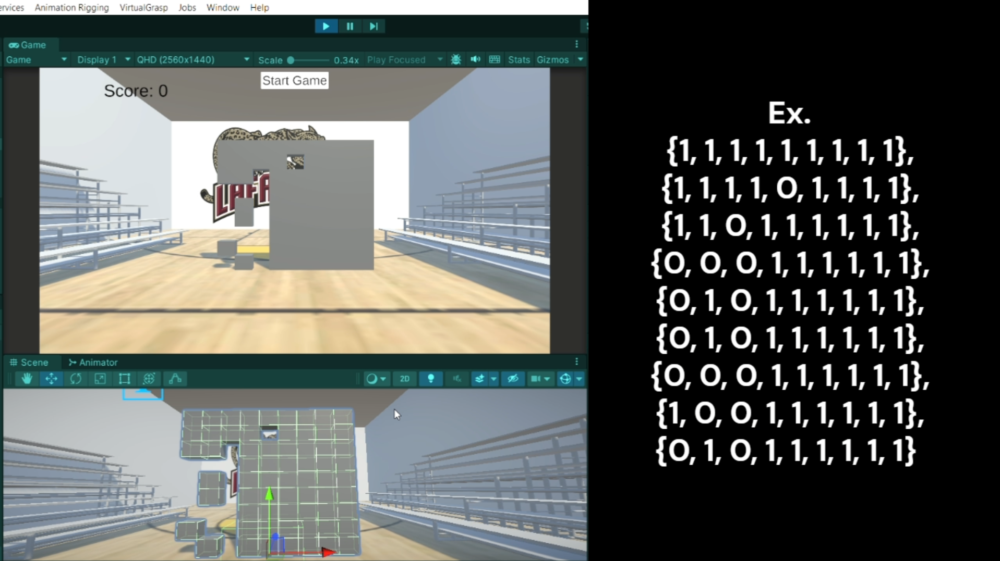
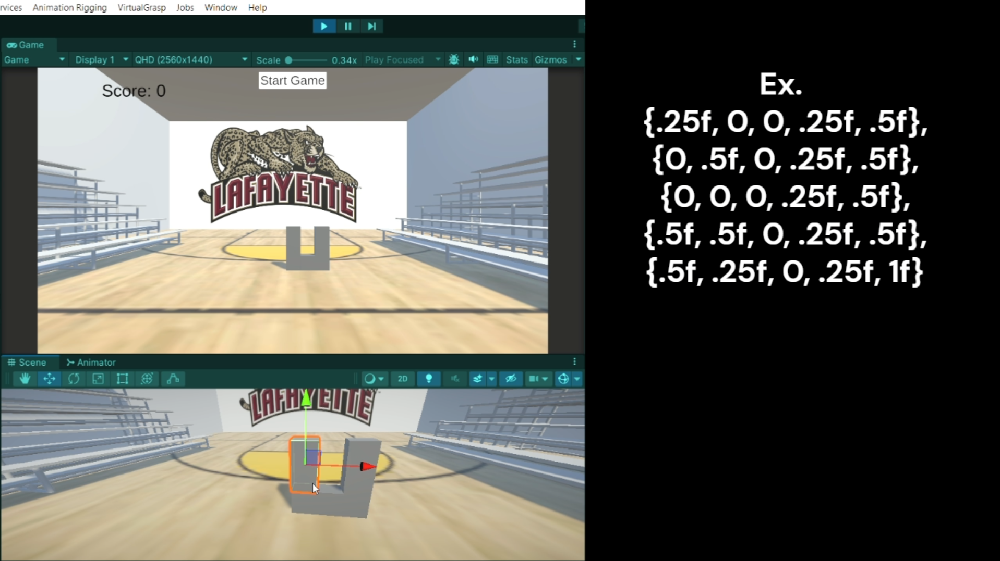
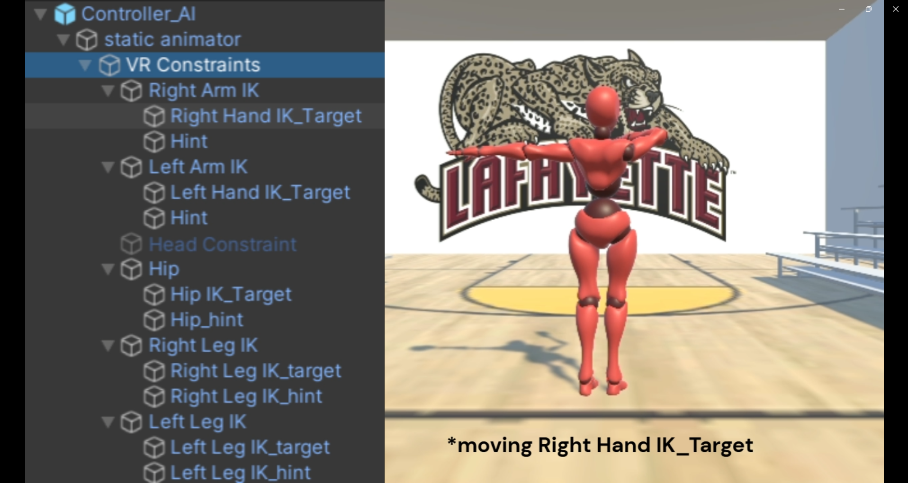

# Hole In The Wall: Reinforcement Learning to personalized obstacles
[sites.lafayette.edu/lopezbec](https://sites.lafayette.edu/lopezbec)

---
In this part of the project the goal is to train a reinforcement Learning Agent to automatically generate new obstacles of different levels of complexity. This with the goal to tailor the obstacles based on individual skills level. In order to achieve this, we first need to figure out a way to automatically measure the complexity of obstacles (i.e., how much energy would an average human use to complete it). To automate this process, the goal is to train a Avatar to pass through obstacles. The full [documentation](https://github.com/lopezbec/Hole_in_Wall_RL_agents/blob/98952624e7567428bcda9a3c49ad8c7cb8bef709/MLAgents_Results/Hole_In_Wall_RLAgents_Documentation.docx) is provided in here.

## References

Ashleve. “GitHub - Ashleve/ActiveRagdoll: From-Scratch Implementation of Physically Simulated Character Animation with Proportional-Integral-Derivative Controllers (PID).” GitHub, 2025, github.com/ashleve/ActiveRagdoll.

Elert, Glenn. “Glenn Elert.” Hypertextbook.com, hypertextbook, 2020, hypertextbook.com/facts/2003/AlexSchlessingerman.shtml.

Liu, Lijia, and Dana Ballard. “Humans Use Minimum Cost Movements in a Whole-Body Task.” Scientific Reports, vol. 11, no. 1, Oct. 2021, https://doi.org/10.1038/s41598-021-99423-5.

Nathan, David, et al. “Estimating Physical Activity Energy Expenditure with the Kinect Sensor in an Exergaming Environment.” PLOS ONE, edited by Jeffrey M Haddad, vol. 10, no. 5, May 2015, p. e0127113, https://doi.org/10.1371/journal.pone.0127113. 

Saeidifard, Farzane, et al. “Differences of Energy Expenditure While Sitting versus Standing: A Systematic Review and Meta-Analysis.” European Journal of Preventive Cardiology, vol. 25, no. 5, Jan. 2018, pp. 522–38, https://doi.org/10.1177/2047487317752186.

Singla, Ashish, et al. “Modeling and Simulation of a Passive Lower-Body Mechanism for Rehabilitation. .” ResearchGate, 2016, www.researchgate.net/figure/Dimensions-of-average-male-human-being-23_fig1_283532449.

Zatsiorsky-Seluyanov. “Adjusted Zatsiorsky-Seluyanov’s Segment Inertia Parameters [HAS-Motion Software Documentation].” Has-Motion.com, 2024, wiki.has-motion.com/doku.php?id=visual3d:documentation:definitions:adjusted_zatsiorsky-seluyanov_s_segment_inertia_parameters. 

--- 

## Wall Generation

There are two ways to generate a wall for the user or agent to dodge the hole in the wall.

**Matrix-based version**:
The typical creation of walls is based on a matrix of int[,]. The default size is 9x9. 0s in the matrix stand for holes, and 1s stand for wall blocks.
The developer can set their own desired width, height, and depth of the wall blocks. These are stored in the variables block_width, block_height, and block_depth respectively. The current default has a width and height that is nearly as big as the X_Bot agent’s head.

**Custom placements of blocks**:
The developer is tasked to build each individual block to create a wall. They must pass the transformations such as the position and sizes. 
The current functionalities, such as RL environment, do not match with the other approach to creating walls. As such, further development to this function is required.

## Agents
Using a combination of ragdoll and Inverse Kinematics, AvatarController allows the developer to move specific limbs to pose and be affected by physics. 

The movement logic is controlled by Inverse Kinematics, where these transformations are stored in the Controller_AI_APose prefab following this child order: Controller_AI_APose/static animator/VR Constraints/(limb) IK/ (limb) IK_Target. Moving this target object allows the agent to move that limb.

The limbs that can be controlled are as follows:
  1. Right/Left Hand (Transformation only)
  2. Hip (Rotation only)
  3. Right/Left Leg (Transformation only)
  4. Body Positioning (Transformation + X Rotation)
  5. Knee (Rotation only) → Dropped due to redundancy and failure to allow ML to learn better.

Each of the limbs have limitations to their transformation or rotation. If transformation of the target objects are outside these limits, logic within the AvatarController snaps the targets to the surface of the colliders and toggle has_over_moved boolean. The reason behind this implementation is to reduce the amount of actions ML agents can perform, as many actions past the limits may result in the same limb pose. These are colliders stored within the “Movement Limits” variables. 
- Arm spans are spheres.
- Rotations limits are based on human limits.
- Leg limits are the bottom half of a sphere.
- Body movement limit is manually set based on the overall wall width to prevent agents from going out of bounds that result in passing the level. 

The logic for physics after moving the static animator is by using Unity’s ragdoll. This allows the agent to move in a more human limited pose, without needing the developer to calculate each individual limb limitations in transformation and rotations. We utilize Ashleve’s ActiveRagdoll code to achieve this setup. 

## Energy Expenditure
Given a pose, calculate the energy required to complete the set of actions. The current implementation are recalibrations of equations from two studies for energy on limbs. 

  1. Mechanical cost for action to pose: https://journals.plos.org/plosone/article?id=10.1371/journal.pone.0127113#pone.0127113.e007

  2. Torque of limbs: https://www.nature.com/articles/s41598-021-99423-5#:~:text=At%20each%20frame%2C%20instantaneous%20power,extends%20the%20potential%20kinds%20of

  3. Maintenance of Pose : https://www.nature.com/articles/s41598-021-99423-5#:~:text=At%20each%20frame%252C%20instantaneous%20power,extends%20the%20potential%20

  4. Alleviation of energy:
https://academic.oup.com/eurjpc/article/25/5/522/5926154#google_vignette

As such, the core calculations is based on two parts, the external and the internal energy from the limbs, and is modified by two other variables based on the pose action (sitting vs standing)

## Reinforcement Learning Through MLAgents Package
The current implementation of reinforcement learning utilizes the MLAgents package. To install the environment, follow steps provided in documentation or wiki. 

  
## Progress and Discussion

As of current progress, there has not been any solution that enables the agent to learn walls, specifically including poses that require leg movements such as squats. Every PPO policy test runs trends towards one problem, where the agent stops defaulting to a single action regardless of passing the wall objective. At this point, the agent also seems to stop learning and exploring, leading to a training environment that is no longer capable of generating a solution.  

Adding an intrinsic reward hyperparameter through GAIL was intended to fix this issue. The idea was to have the agent revert or lean on the predefined poses provided by the GAIL demonstration to speed up learning and allow the policy to collapse. However, while the policy never collapsed like the pure PPO training runs, the agent performs worse and does not seem to learn. As such, GAIL hyperparameter is also not a valid fix.

Using SAC as a policy does not work as well. SAC does not restrict learning to a sequential execution, causing the environment and physics to not keep up. For instance, when the agents receive an action, they usually instantly move their limbs into the destination. However, while the action is completed, the limbs of the ragdoll component are delayed. Occasionally some agents would only snap to their poses well after the wall or episode has ended, leading to misleading results. This makes SAC impossible to run for the current implementation. 

### Possible Solutions

Modify the learning environment:
- The large observation size may be causing too much noise for the agent to learn. Removing scalings and locations of wall blocks from the observation size may help. Similarly, removing limb information from the observation matrix may help too.
- The current leg and foot colliders may be causing inconsistencies. To fix this, implement realistic balancing on the ragdoll. This balance must also allow the agent to squat or sit, as most balancing algorithms and methods are strictly for an agent to not fall. 
- Instead of a single decision per episode, allow the agent to request as many decisions before the wall moves to adjust positioning. This may not work well since once the agent falls, there is no recovery.

Different Machine Learning Algorithms for One-Shot Continuous Control Problem
- Covariance Matrix Adaptation Evolution Strategy 
- Bayesian Optimization
- Augmented Random Search
- MAP-Elites 
- Natural Evolution Strategies (NES)

